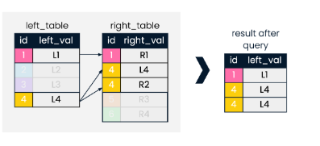
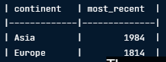

# Notes

## Introduction

**SELECT** - used to select columns

' ***** ' - means to select all

**DISTINCT** - used to eliminate duplicates

**FROM** - choose to any table

**WHERE** - find in what column

**IN** - find specific record

**LIKE** - used to find pattern 'A%' means starting with 'A', %z means ending matches with 'z', %the% means anything that containt the word the

**BETWEEN** '_' **AND** ' _' - used to filter certain range

## Aggregates

* `COUNT()`: returns the number of rows.

  * SELECT COUNT(*)
    FROM table_name;
* `MAX()`: returns the largest value in a column.

  * SELECT MIN(plays)
    FROM playlist;
* `MIN()`: returns the smallest value in a column.
* `SUM()`: returns the total sum in a column.

  * SELECT SUM(plays)
  * FROM playlist;
* `AVG()`: returns the average value in a column.

  * SELECT AVG(plays)
    FROM playlist;
* ROUND():

GROUP BY - used to group attributes

### Arithmetic

+, -, *, and /

note: always used alias

Example

SELECT (4+3);

SELECT title, duration, duration / 60.0 AS duration_hours
FROM films;

SQL (Structured Query Language)

- let's us quickly access thru commands

Table names - lowercase

rows - records

columns - fields

Data stored in a servers harddisk

Schema = blueprints of databases

- what tables are included, relationship and what it can hold

Query is the code

Result set yung results

---

Code

SELECT field_name AS alias_name - alias the field to first name

CREATE VIEW field_name AS - showing the results up to date/ saving

to verify ^ SELECT * FROM field_name;

---

## Intermediate SQL

Most common errors:

- Misspelling
- Incorrect capitalization
- Incorrect or missing punctuations, especially commas

---

## Filtering Records

<> = not equal to

OR = satisfy at least one condition (need to specify field name)

AND = both situation must be satisfy (need to specify field name)

note: can have multiple and

BETWEEN __ AND __- filtering values within specific range

#### Example:

SELECT title, release_year
FROM films
WHERE (release_year BETWEEN 1994 AND 2000)
AND (language = 'English' OR language = 'Spanish')
AND gross > 2000000;

SELECT ROUND(AVG(facebook_likes),1) AS avg_facebook_likes

FROM reviews;

### Filtering Text

- Filter a pattern rather than specific text
- LIKE

  - used to search for a pattern in a field
  - % match zero, one, or many characters
    - SELECT name
    - FROM people
    - WHERE name LIKE 'Ade%';
      - Starts with Ade
      - '%ade' end with ade
  - _ match a single character
    - SELECT name
    - FROM people
    - WHERE name LIKE 'Ev_';
      - Fill the next letter
      - '_ _ t%' find the record with third letter 't'
- NOT LIKE

  - records that don't match the pattern
    - SELECT name
    - FROM people
    - WHERE name NOT LIKE 'A.%';
- IN

  - allow specify multiple values in a WHERE clause
    - SELECT title
    - FROM films
    - WHERE release_year IN (1920, 1930, 1940);
    - WHERE country IN ('Germany', 'France');SELECT COUNT(DISTINCT title) AS nineties_english_films_for_teens

  #### Example:
- SELECT COUNT(DISTINCT title) AS nineties_english_films_for_teens
  FROM films
  WHERE release_year BETWEEN 1990 AND 1999
  AND language = 'English'
  AND certifications IN ('G', 'PG', 'PG-13');
- IS NULL

  - missing values
- IS NOT NULL

  - have anything

## Sorting Results

**ORDER BY** - sorts the data in ascending order

**ORDER BY __ DESC** - sorts data in descending order

## Grouping Data

**GROUP BY __** - provide summary when grouping a single field

### Example

Using the `films` table: which `release_year` had the most language diversity?

Take your time to translate this question into code and test your queries in the console.

"Most language diversity" can be interpreted as `COUNT(DISTINCT ___)`. Now over to you.

SELECT release_year, COUNT(DISTINCT language) AS diverse_language

FROM films

GROUP BY release_year

ORDER BY diverse_language DESC

LIMIT 1;

## Filtering Grouped Daata

**HAVING -** keyword for GROUP BY

WHERE filters individual records, HAVING filters grouped records

# Joining Data in SQL

## Introducing Inner Joins

### The ins and outs of INNER JOIN

INNER JOIN + LEFT JOIN = COMBINED TABLES

ID_field = key

Inner Join = looks for records with the same values in the key field

will return duplicate value

#### Syntax

table.column_name

##### Example:

-- Select fields with aliases

SELECT c.code AS country_code, name, year, e.inflation_rate

FROM countries AS c

-- Join to economies (alias e)

**INNER JOIN** economies AS e

-- Match on code field using table aliases

ON c.code = e.code; || or USING (country)

Defining relationships

One-to-many

One-to-one

Many-to-many

### Multiple Joins

#### Syntax

SELECT * #here mo ilalagay kung anong column want mo

FROM left_table

INNER JOIN right_table

ON left_table.id = right_table.id #here naman yung kaparehas nila na identifier

    AND left_table.date = right_table.id

INNER JOIN another_table

ON left_table.id = another_table.id  # bali you can use using sa same id sa new table na imemerge mo

##### Example:

SELECT p1.country, p2.continent, president, prime_minester, pm_start

FROM prime_minister as p1

INNER JOIN presidents as p2

USING (country)

INNER JOIN prime_minester_terms as p3

USING (prime_minester)

## Outer Joins, Cross Joins and Self Joins

### Left and Right Joins

Bali here sa left join pwede masama lahat ng query kahit hindi match sa right join, pero yung right join yung unmatch is hindi makakasama. Magiging null yung rest ng left join

#### Syntax

SELECT p1.country, prime_minister, president

FROM prime_ministers AS p1

**LEFT JOIN** presidents AS p2 #pwede ring syntax na LEFT OUTER JOIN

USING (country);

Same lang sa RIGHT JOIN, but reverse (RIGHT OUTER JOIN)

### FULL JOINS

return all ids irrespective of whether they have a match, bali null yung mga walang match

#### Syntax

SELECT left_table.id AS L_id, right_table.id AS r_id, left_table.val AS L_val, right_table.val AS R_val

FROM left_table

**FULL JOIN** right_table

USING(id);

##### Example:

SELECT p1.country AS country, prime_minester, president

FROM prime_ministers AS p1

FULL JOIN presidents AS p2

ON p1.country = p2.country

LIMIT 10;

### CROSS JOINS

- creates all possible combinations of two tables

  

#### SYNTAX

SELECT id1, id2

FROM table1

CROSS JOIN table2;

##### Example:

SELECT prime_minester, president

FROM prime_ministers AS p1

CROSS JOIN presidents AS p2 ##KAPAG Cross Join you don't have to use ON or USING

WHERE p1.continent IN ('Asia')

    AND p2.continent IN ('South America')

### SELF JOINS

- table joined with themselves
- can be used to compare parts of the same table

#### SYNTAX

##### EXAMPLE

SELECT p1.country AS country1, p2.country AS country2, p1.continent

FROM prime_ministers AS p1

INNER JOIN prime_ministers AS p2

ON p1.continent = p2.continent

    AND p1.country <> p2.country

LIMIT 10;

# Set Theory for SQL Joins

## Set theory for SQL Joins

UNION - takes two tables as input, and returns all records from both tables not including duplicates

### Syntax

SELECT *

FROM left_table

UNION

SELECT *

FROM right_table;

#### Examples:

SELECT monarch AS leader, country

FROM monarchs

UNION

SELECT prime_ministers, country

FROM  prime_ministers

ORDER BY country, leader

LIMIT 10;

UNION ALL - takes two tables and returns all records from both tables including duplicates

### Syntax

SELECT *

FROM left_table

UNION ALL

SELECT *

FROM right_table;

Note: Do not require "ON" rather than comparing and merging tables on the left and right, they stack fields on top of one another

#### Examples:

SELECT monarch AS leader, country

FROM monarchs

UNION

SELECT prime_ministers, country

FROM  prime_ministers

ORDER BY country, leader

LIMIT 10;

Note: Use the first column name when using ORDER BY

## At the INTERSECT

### Syntax

SELECT *

FROM left_table

INTERSECT

SELECT *

FROM right_table;

Note: Will return one value unlike inner join-duplicate

#### Example

SELECT country AS intersect_country

FROM prime_ministers

INTERSECT

SELECT country

FROM presidents;

## EXCEPT

- allows us to identify the records that are present in one table, but not the other

#### Example

SELECT monarch, country

FROM monarchs

EXCEPT

SELECT prime_ministers, country

FROM prime_ministers;

# Subqueries

## Subquerying with semi joins and anti joins

- a semi joins chooses records in the first table where a condition is met in the second table

  

### Example - Semi Join

SELECT presidents, country, continent

FROM presidents

WHERE country **IN**

    (SELECT country

    FROM states

    WHERE indep_year < 1800);

- use list of countries as a filter by embedding it in a further WHERE clause
- Note: this is a subquery

### Example - Anti Join

SELECT presidents, country,

FROM presidents

WHERE country **LIKE** '%America'

    AND  country**NOT IN**

    (SELECT country

    FROM states

    WHERE indep_year < 1800);

## Subqueries inside WHERE and SELECT

- WHERE IN enables us to provides  a list of values filter on
- Second most type of subquery is SELECT clause

### Syntax

SELECT *

FROM some_table

WHERE some_field IN

    (SELECT some_numeric_field

    FROM another_table

    WHERE field2 = some_condition)

#### Example

SELECT *

FROM populations

WHERE year = 2015

-- Filter for only those populations where life expectancy is 1.15 times higher than average

  AND life_expectancy > 1.15 *

  (SELECT AVG(life_expectancy)

   FROM populations

   WHERE year = 2015);

## Subqueries inside FROM

- returns duplicates for multiple occurences of id when it matches in both tables
- 
- can drop duplicates using the DISTINCT comman

### Syntax

- with duplicates

SELECT left_table.id, left_val

FROM left_table, right_table

WHERE left_table.id = right_table.id

- without duplicates

SELECT DISTINCT left_table.id, left_val

FROM left_table, right_table

WHERE left_table.id = right_table.id

#### Example

SELECT DISTINCT  monarchs.continent, sub.most_recent

FROM monarchs

    (SELECT continent, MAX (indep_year) AS most_recent

    FROM states

    GROUP BY continent) AS sub

WHERE monarchs.continent = sub.continent

ORDER  BY continent;

# Intermediate SQL

## We'll take the Case

### We'll take the Case

- contains a WHEN, THEN, and ELSE statement, finished with END

#### SYNTAX

CASE WHEN x = 1 THEN 'a'
WHEN x = 2 THEN 'b'
ELSE 'c' END AS new_column

##### Example

SELECT

    CASE WHEN hometeam_id = 10189 THEN 'FC Schalke 04'

    WHEN hometeam_id = 9823 THEN 'FC Bayern Munich'

    ELSE 'Other' END AS home_team,

    COUNT(id) AS total_matches

FROM matches_germany

-- Group by the CASE statement alias

GROUP BY home_team;

### In CASE things get more complex

- What's in your ELSE clause
- 

#### Syntax

##### Example

SELECT date, hometeam_id, awayteam_id

    CASE WHEN hometeam_id = 8455 AND home_goal > away_goal

    THEN 'Chealse home win!'

    WHEN awayteam_id = 8455 AND home_goal < away_goal

    THEN 'Chealse away win!'

    ELSE 'Loss or tie :(' END AS outcome

FROM match

WHERE hometeam_id = 8455 OR awayteam_id = 8455;

### CASE WHEN with aggregate functions

- Case statements are great for
  - Categorizing data
  - Filtering data
  - Aggregating data

#### Syntax

##### Example

**CASE WHEN with COUNT**

SELECT season,

    COUNT(CASE WHEN hometeam_id = 8650 AND home_goal > away_goal THEN id END) AS home_wins

FROM match

GROUP BY season;

**CASE WHEN with SUM**

SELECT season,

    SUM(CASE WHEN hometeam_id = 8650 THEN home_goal END) AS home_goals

    SUM(CASE WHEN awayteam_id = 8650 THEN away_goal END) AS away_goals

FROM match

GROUP BY season;

**CASE WHEN with AVG**

SELECT season,

    ROUND(AVG(CASE WHEN hometeam_id = 8650 THEN home_goal END),2) AS avg_homegoals

    ROUND(AVG(CASE WHEN awayteam_id = 8650 THEN away_goal END),2) AS avg_awaygoals

FROM match

GROUP BY season;

**PERCENTAGES with CASE and AVG**

SELECT season,

    AVG(CASE WHEN hometeam_id = 8455 AND home_goal > away_goal THEN 1

    WHEN  hometeam_id = 8455 AND home_goal < away_goal THEN 0 END) AS pct_homewins

    AVG(CASE WHEN hometeam_id = 8455 AND away_goal > home_goal THEN 1

    WHEN  hometeam_id = 8455 AND away_goal < home_goal THEN 0 END) AS pct_awaywins

FROM match

GROUP BY season;

## Short and Simple Subqueries

Why subqueries?

- Comparing grgoups to summarized values
- Reshaping data
- Combining data that cannot be joined

Simple Subqueries - can be evaluated independently from the outer query

- evaluated once in the entire statement

Ex. SELECT home_goal

    FROM match

    WHERE home_goal > (

    SELECT AVG(home_goal)

    FROM match)

SELECT AVG(home_goal) FROM match;

- can run on its own and get a result

### WHERE are the Subqueries?

#### Syntax

##### Example

SELECT date, hometeam_id, awayteam_id, home_goal, away_goal

FROM match

WHERE season = '2012/2013'

    AND home_goal > (SELECT AVG(home_goal)

    FROM match);

### Subqueries in FROM

- restructure and transform your data
  - transform data from long to wide before selecting
  - prefiltering data
- Calculating aggregates of aggregates
- You can create multiple subqueries in one FROM statement
  - Alias them!
  - Join them!
- You can join a subquery to a table in FROM
  - include a joining columns in both tables!

#### Syntax

##### Example

SELECT t.team_long_name AS team, AVG(m.home_goal) AS home_avg

FROM match AS m

LEFT JOIN team AS t

ON m.hometeam_id - t.team_api_id

WHERE season = '2011/2012'

GROUP BY team;

SELECT team, home_avg

FROM (SELECT

    t.team_long_name AS team, AVG(m.home_goal) AS home_avg

    FROM match AS m

    LEFT JOIN team AS t

    ON m.hometeam_id - t.team_api_id

    WHERE season = '2011/2012'

    GROUP BY team) AS subsequery

ORDER BY home_avg DESC

LIMIT 3;

### Subqueries in SELECT

SELECT WHAT

- returns a single value
  - include aggregate values to compare to individual values
- used in mathematical calculations
  - deviation from the average

Things to keep in mind:

- Need to return a SINGLE vlaue
  - WIll generate an error otherwise
- Make sure you have all filters in the right places
  - Properly filter both the main and the subquery

#### Syntax

##### Example

SELECT date, home_goal + away_goal) as goals,

(home_goal + away_goal), -

    (SELECT AVG(home_goal + away_goal)

    FROM match

    WHERE season = '2011/2012') AS diff

FROM match

WHERE season = '2011/2012';

SELECT season, COUNT(id) AS matches, 12837 as total_matches FROM match GROUP BY season;

### Subqueries everywhere! And best practices!

#### Syntax

##### Example

SELECT
    s.stage,
    ROUND(s.avg_goals, 2) AS avg_goal,
    (SELECT AVG(home_goal + away_goal)
     FROM match WHERE season = '2013/2014') AS overall_avg
FROM
    (SELECT
        stage,
        AVG(home_goal + away_goal) AS avg_goals
     FROM match
     WHERE season = '2013/2014'
     GROUP BY stage) AS s
WHERE
    s.avg_goals > (SELECT AVG(home_goal + away_goal)
                   FROM match WHERE season = '2013/2014');
