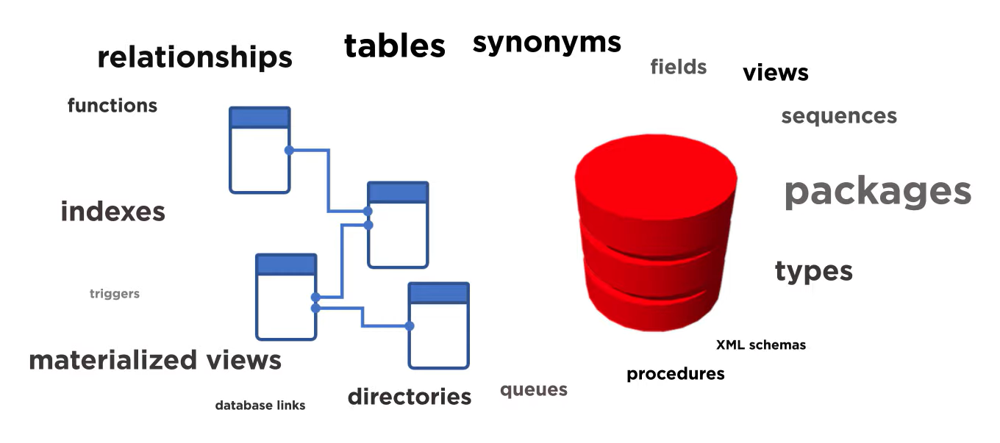

# Creating PostgreSQL Databases

## Structure of PostgreSQL Database

### Creating a database

CREATE DATABSE db_name;

### Creating tables

#### Syntax

CREATE TABLE table_name(

    column1_name column1_datatype [col1_constraints}

);

##### Example

CREATE TABLE school (

    id serial PRIMARY KEY,

    name TEXT NOT NULL

    mascot_name TEXT

);

### Creating schemas

Providing database users with separate environments

If schema is a series it is a schema write e.g. details of a customer

If a schema has a centralized table it is a schema read  e.g. for high scale information delivery (star schema)

**Schema Uses**

- organizing database objects into related groups

**The default schema**

- The public schema is the default schema in PostgreSQL

#### Example

CREATE TABLE school (

    id serial PRIMARY KEY,

    name TEXT NOT NULL

    mascot_name TEXT

);

name of schema: public.school

**Create SCHEMA command**

#### Syntax

CREATE SCHEMA schema_name;

##### Example

CREATE SCHEMA division1;

CREATE TABLE division1.school (

    id serial PRIMARY KEY,

    name TEXT NOT NULL

    mascot_name TEXT,

    num_scholarships INTEGER DEFAULT 0 --IF NO VALUE IS EXPLICITLY STATED

);

## PostgreSQL Data Types

### Introduction to PostgreSQL data types

#### Data categories in PostgreSQL

- Text - names, product descriptions
- Numeric - order size and physical descriptions
- Temporal - delivery dates and timestamps
- Boolean - True/False
- Others: Geometric/Binary

##### Example 1: representing birthdays

- Cathy: May 3rd, 2006
- Possible representations
  - "May 3, 3006" (text)
  - "5/3/2006" (text)
  - 2006-05-03 (date)

##### Example 2:  trackling payment status

- Did attemding member pay?
- Possible representations:
  - "Yes"/"No" (text)
  - "Y"/"N" (text)
  - 'true'/'false' (boolean)
- Specific types provide restriction on values

##### Example 3: trip distance

- Mark flew 326 miles for client meeting
- Possible representations
  - "326 miles" (text)
  - "326" (text)
  - 326 (numeric)

##### Example: 

-- Create the project table

CREATE TABLE project(   -- Unique identifier for projects

    id SERIAL PRIMARY KEY,

    -- Whether or not project is franchise opportunity

    is_franchise boolean DEFAULT FALSE,

    -- Franchise name if project is franchise opportunity

    franchise_name text DEFAULT NULL,

    -- State where project will reside

    project_state text,

    -- County in state where project will reside

    project_county text,

    -- District number where project will reside

    congressional_district numeric,

    -- Amount of jobs projected to be created

    jobs_supported numeric

);
